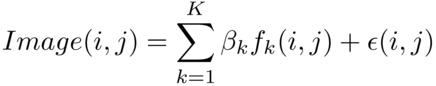
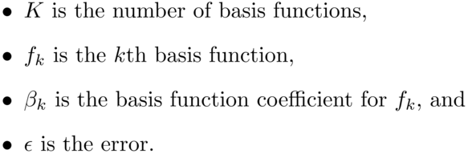

---
output:
  md_document:
    variant: markdown_github
---

<!-- README.md is generated from README.Rmd. Please edit that file -->

```{r, echo = FALSE}
knitr::opts_chunk$set(
  collapse = TRUE,
  comment = "#>",
  fig.path = "README-",
  tidy=TRUE
)
```

# cartridges

This package contains utilities to read, center and plot cartridge images. It implements a method of creating a signature from such images. This is work in progress.

Images must be in the standard format as released by the National Institute of Standards and Technology (NIST). Such data are available from the [NIST Ballistics Toolmark Research Database](http://www.nist.gov/forensics/ballisticsdb/), and in particular we are developing methods for images of breech face impressions using 2D ring light. An example image from the database is below.

```{r,echo=FALSE,fig.width=4,fig.height=3}
library(devtools)
devtools::load_all(quiet=TRUE)
LL1_3 <- readCropTIFF(system.file("extdata", "LL1_3.tif", package = "cartridges"),crop=FALSE)
par(mar=c(0,0,0,0))
plot(c(1,2592), c(1,1944),type="n",xaxt="n",yaxt="n",xlab = "", ylab = "",yaxs="i",xaxs="i")
rasterImage(LL1_3/255,1,1,2592,1944,interpolate=FALSE)
```


## Description of method
The goal is to compute a "signature" from a high-resolution cartridge case image. Such a signature would enable the rapid matching of new images to a database of existing images.

To construct such a signature, we make use of the circular symmetry of the image. We assume that pixels located the same distance from the center of the image take the same value. We can then decompose each image into a linear combination of circularly symmetric basis. The first few matrices in the basis are given in the figure below, where each figure in the panel represents one matrix. Each matrix takes the value 1 for pixels that are the same distance from the center, and zero otherwise. Basis are enumerated from center outwards.

```{r, echo=FALSE,fig.height=2,fig.width=4}
m<-33
n<-(m-1)/2
values<-expand.grid(i=-n:n,j=-n:n,KEEP.OUT.ATTRS=FALSE) 
values$i2j2<-values$i^2+values$j^2
basis33<-split(values,f=values$i2j2)

plotBasis<-function(basisNumber,imageSize){
    tmpImage<-matrix(0,nrow=imageSize,ncol=imageSize)
    ones<-basis33[[basisNumber]]
    for (i in 1:nrow(ones)){
        if (abs(ones[i,"i"])<=(imageSize-1)/2 & abs(ones[i,"j"])<=(imageSize-1)/2){
            tmpImage[ones[i,"i"]+(imageSize+1)/2,ones[i,"j"]+(imageSize+1)/2]<-1
        }
    }
    plot(c(0,3), c(0,3), type = "n", xaxt = "n", yaxt = "n", xlab = "", ylab = "")
    rasterImage(tmpImage,0,0,3,3,interpolate=FALSE)
}

par(mfrow=c(2,4))
par(mar=c(0,0,0,0))
par(oma=c(0,0,0,0))
for (i in 1:8){
    plotBasis(i,33)
}
```

We represent these matrices as circularly symmetric basis functions, which take an ij coordinate as an input and return the value 0 or 1. An image can then be decomposed as follows:





The coefficient of each basis function is the mean of pixel values of pixels in that basis function, and these form the image signature. The number of basis functions required depend on the size of the image. Standard images in the NIST database are 2592 x 1944 pixels, and after cropping to square we have images that are 1919 x 1919 pixels. A total of 276,569 basis functions are required for such images.

## Installation

If you do not have R installed, visit https://www.r-project.org/. You will also need to install the `devtools` package from CRAN using `install.packages("devtools")`.

To install this package:
```{r, eval=FALSE}
library(devtools)
devtools::install_github("xhtai/cartridges")
```
Then load the package using 
```{r, eval=FALSE}
library(cartridges)
```

## Functions available
* `readCropTIFF()`: to read in a raw image and obtain a matrix of pixel values
* `plotImage()`: produces a plot from the matrix of pixel values
* `shiftedImage()`: to shift the image to a specified center
* `getBasisFunctions()`: to produce ij coordinates of the location of 1's for each basis function
* `subsetBasis()`: returns basis functions with specified conditions, e.g. those with a certain number of pixels or those that are of a certain distance from the center
* `statisticsByBasisFunction()`: calculates statistics for each basis function, e.g. mean of pixel values
* `fitBasis()`: to fit basis functions and obtain coefficients for the image signature
* `getFittedImage()`: produces a matrix of pixel values from the basis function coefficients

These are for centering the image, and the methodology is described further in the section below.

* `roughCenter()`: computes a rough center location, to be used as a starting location for a grid search
* `gridSearch()`: searches a grid of possible locations for the center of the image
* `surfacePlot()`: produces a surface plot for determining the best location of the center

### Methods for centering images
Before the basis functions are fitted, the image has to be properly centered. To determine an appropriate center, we first notice that images have a dark, symmetric outer ring. We fit the basis functions corresponding approximately to the radius of this ring, and if the image is properly centered, the fit obtained should be good.

We use basis functions with radius 450-1000 pixels, and compute the residual sum of squares of the fit. A better fit would produce a smaller residual sum of squares. We search over a grid of possible values, and the location resulting in the smallest residual sum of squares is the best center location. This is visualized using `surfacePlot()`.

As the grid search is a slow process, we can choose to use `roughCenter()` to first determine an appropriate starting location. Briefly, the steps are as follows:

* convert the images from 256-grayscale to binary values, with values from 0 to 127 taking the value 0 and those from 128 to 255 taking the value 1
* along an input row, consider 201 possible center locations from columns 860 to 1060
* at each possible center, sum the binary pixel values for each basis function. Find the longest continuous string of basis functions where the calculated sum is zero, and obtain the number of basis functions in that string.
* the best column is the one with the longest continuous string of zeros
* along the best column, consider 201 possible rows (100 above and 100 below the input row)
* choose the center resulting in the longest string of continuous zeros.

We recommend repeating this for rows 940 and 980. To speed up the process further, we can use only basis functions with 8 pixels, as these are the most common.


## Example
The following steps produce a signature for the example image above. This image is from the [Laura Lightstone study](http://www.nist.gov/forensics/ballisticsdb/lightstone-study.cfm) in the NIST database.

First read in the data:
```{r, eval=FALSE}
LL1_3 <- readCropTIFF(system.file("extdata", "LL1_3.tif", package = "cartridges"))
```

We can plot this image:
```{r, eval=FALSE}
plotImage(LL1_3,"original",grayscale=TRUE,main="Cartridge Image from Laura Lightstone Study")
```

Next we obtain the basis functions for an image of size 1919 x 1919 pixels. (Note that this might take up to half an hour. If you do not want to wait, the data produced is pre-loaded with this package and you can access it by just referring to `basis1919`, e.g. `length(basis1919)`.)

```{r, eval=FALSE}
basis1919<-getBasisFunctions(1919)
```

We take subsets of the basis functions by specifying the radius from the center of the outer ring (450-1000 pixels), and the number of pixels in each basis function.

```{r, eval=FALSE}
basis1919_rad450_1000<-subsetBasis(basis1919,c(450,1000))
basis1919_8pixels_rad450_1000<-subsetBasis(basis1919,c(450,1000),8)
```

Now we determine a rough center by searching along row 980. Again, note that this is a long computation and may take up to half an hour. If you do not want to wait, the coordinates produced are (962, 964), and you can simply input this into `gridsearch()` using `gridsearch(LL1_3,basis1919_rad450_1000,962,964)`.

```{r, eval=FALSE}
out <- roughCenter(LL1_3, basis1919_8pixels_rad450_1000, 980)
best<-out[which.max(out$maxRun),]
```

We then do a grid search for the smallest residual sum of squares, producing a surface plot for visualization. This could take up to an hour, and should produce the coordinates (970, 962) as the best center.

```{r, eval=FALSE}
RSSdtf<-gridSearch(LL1_3,basis1919_rad450_1000,best$i,best$j,plot=TRUE)
best<-RSSdtf[which.min(RSSdtf$totalRSS),]
```

With the center (970, 962), we shift the image as follows.

```{r, eval=FALSE}
shifted<-shiftedImage(LL1_3,best$centeri,best$centerj)
```

We can then fit the basis functions using `LL1_3_basis<-fitBasis(shifted,basis1919)`, but a better alternative would be to first crop the image. This is because with the shifting process, we introduced a black border by setting pixels that were not available to 0. Cropping the image would remove this border.

```{r, eval=FALSE}
shifted<-shifted[76:1844,76:1844]
LL1_3_basis<-fitBasis(shifted,basis1769)
```

Now with the fitted coefficients, we can obtain and plot the fitted 1769 x 1769 image.

```{r, eval=FALSE}
fittedImage<-getFittedImage(LL1_3_basis,basis1769,1769)
plotImage(fittedImage,"original",grayscale=TRUE,main="Fitted Image")
```

We can also obtain and plot the residuals.
```{r, eval=FALSE}
residualImage<-shifted-fittedImage
plotImage(residualImage,"residuals",grayscale=TRUE,main="Residual Image")
```


## Further work
This is work in progress and there are many possible improvements to both the methodology and the code. Some of these are:

* Develop additional methods to model the residuals and capture the asymmetries
* Reduce the dimension further by fitting a local smoother
* Many code speed-ups are possible.
