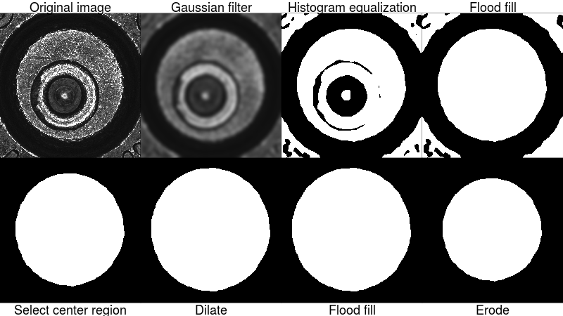
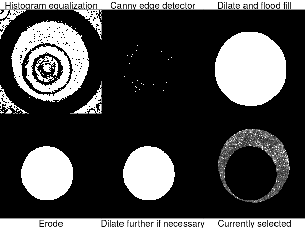
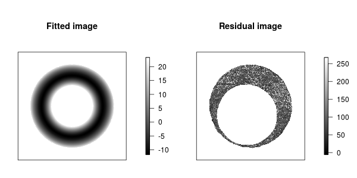

---
output:
  md_document:
    variant: markdown_github
bibliography: /home/xtai/Desktop/research/papers/cartridgerefs.bib
---

<!-- README.md is generated from README.Rmd. Please edit that file -->

```{r, echo = FALSE}
knitr::opts_chunk$set(
  collapse = TRUE,
  comment = "#>",
  fig.path = "README-",
  tidy = TRUE
)
```

# cartridges

This package contains utilities to read and plot cartridge case images. It pre-processes these images and implements an algorithm to compare the images. It produces a similarity score for each pairwise comparison and computes the probability of obtaining a higher score by chance. This is work in progress.

Images must be in the standard format as released by the National Institute of Standards and Technology (NIST). Such data are available from the [NIST Ballistics Toolmark Research Database](https://tsapps.nist.gov/NRBTD), and in particular we are developing methods for images of breech face impressions using 2D ring light. This methodology has been tested on images from the NBIDE study in the database. An example image from the database is below.

```{r, echo = FALSE, fig.width = 4, fig.height = 3, eval = FALSE}
library(devtools)
devtools::load_all(quiet = TRUE)
NBIDE118 <- readCartridgeImage(system.file("extdata", "NBIDE R BF 118.png", package = "cartridges"))
plotImage(NBIDE118)
```


## Background
When a gun is fired, it leaves marks on the bottom surface of the cartridge, and these marks are thought to be unique to the gun, in other words each gun is thought to produce unique marks. Here the marks that we are interested in are the breechface marks, which are marked out in the image below. These marks are caused by the bottom surface of the cartridge pressing against the breech block of the gun during the firing process.


Since the marks are thought to be unique, when cartridge cases are collected from crime scenes, they can be compared to cartridge cases that have been collected previously, to see if they come from the same gun as something that has been seen before. Because of the large number of cartridge cases being collected, rather than comparing these physical cartridge cases, we are interested in using automated algorithms to compare these images of the bottom surface of the cartridge cases.

Given a new image and a database of images, this package implements tools to assess how similar the new image is to the images in the database, producing a similarity metric. To quantify the uncertainty in this comparison procedure, and also attach more meaning to the similarity scores, we also propose a method of computing the probability of obtaining a larger score by chance.


## Description of method
These are the steps for one pairwise comparison. There are 4 pre-processing steps before we compute the two measures that we are interested in.

1. Automatically select breechface marks
2. Level image
3. Remove circular symmetry
4. Outlier removal and filtering
5. Maximize correlation by translations and rotations
6. Compute probability of obtaining a higher score by chance

Steps 2, 4 and 5 are implementations (with modifications) of work that has been done at NIST [@Vorburger2007] and other groups [@Roth2015]. We illustrate each of these steps using an example image.

### Step 1
The first step is to automatically select the breechface marks, and this is broken into two steps, finding the primer region and then removing the firing pin impression. A rough schema for finding the primer region is as follows.

```{r, echo = FALSE, eval = FALSE}
library(cartridges)
makeBinary <- function(image) {
    med <- median(image)
    ret1 <- ifelse(image < med, 0, 1)
    diff1 <- abs(sum(ret1 == 1) - sum(ret1 == 0))
    ret2 <- ifelse(image <= med, 0, 1)
    diff2 <- abs(sum(ret2 == 1) - sum(ret2 == 0))
    
    if (diff1 <= diff2) return(ret1) else return(ret2)
}

ebimage <- EBImage::readImage(system.file("extdata", "NBIDE R BF 118.png", package = "cartridges"))
I <- ebimage[337:2255, 13:1931]

sigma <- 25
blurred <- EBImage::gblur(I, sigma, radius = 2 * ceiling(2 * sigma) + 1)

equalized <- makeBinary(blurred)

# imfill
tmp <- EBImage::fillHull(equalized)

# bwlabel -- choose the center region
L = EBImage::bwlabel(tmp)
ij <- matrix(c(959, 600, 1200, 959, 959, 960, 960, 960, 600, 1200), ncol = 2)

Mode <- function(x) {
    ux <- unique(x)
    ux[which.max(tabulate(match(x, ux)))]
}
tmp2 <- tmp
tmp2[L != Mode(L[cbind(ij)])] <- 0

##### dilate, fill and erode
se <- EBImage::makeBrush(size = 139, shape = "disc") # should be odd
tmp3 <- EBImage::dilate(tmp2, se)
filled <- EBImage::fillHull(tmp3)
se <- EBImage::makeBrush(size = 269, shape = "disc") # should be odd
primer <- EBImage::erode(filled,se)

png(file = "/home/xtai/Desktop/cartridges/README-primer.png", width = 800, height = 450)
par(oma = c(2, 0, 2, 0))
par(mfrow = c(2, 4))
plotImage(I*255)
mtext(text = "Original image", side = 3, cex = 1.5)
plotImage(blurred*255)
mtext(text = "Gaussian filter", side = 3, cex = 1.5)
plotImage(equalized*255)
mtext(text = "Histogram equalization", side = 3, cex = 1.5)
plotImage(tmp*255)
mtext(text = "Flood fill", side = 3, cex = 1.5)
plotImage(tmp2*255)
mtext(text = "Select center region", side = 1, cex = 1.5, line = 1)
plotImage(tmp3*255)
mtext(text = "Dilate", side = 1, cex = 1.5, line = 1)
plotImage(filled*255)
mtext(text = "Flood fill", side = 1, cex = 1.5, line = 1)
plotImage(primer*255)
mtext(text = "Erode", side = 1, cex = 1.5, line = 1)
dev.off()
```




To remove the firing pin impression, we use use a similar set of steps, but we start with an edge detector to first identify the firing pin region. This would work even if the firing pin impression isn't circular. 

```{r, echo = FALSE, eval = FALSE}
ebimage <- EBImage::readImage(system.file("extdata", "NBIDE R BF 118.png", package = "cartridges"))
J <- makeBinary(ebimage)
J <- J[337:2255, 13:1931]
    
# canny
sigma <- 32 # changed from 32
blurred <- EBImage::gblur(J, sigma)

tmp <- blurred@.Data
imagerImage <- imager::as.cimg(tmp)
out <- cartridges:::cannyEdges(imagerImage*255, q1 = .83*.4, q2 = .83)

out[primer == 0] <- 0
    
if (sum(out) < 2000) {
    thres <- .83
    while (sum(out) < 2000) {
        thres <- thres - .02
        out <- cartridges:::cannyEdges(imagerImage*255, q1 = thres*.4, q2 = thres)
        out[primer == 0] <- 0
    }
}
    
outtmp <- as.matrix(out)
outebimage <- EBImage::Image(outtmp, colormode = 'Grayscale') # back to ebimage

se <- EBImage::makeBrush(size = 399, shape = "disc") # should be odd
tmp <- EBImage::dilate(outebimage, se)
tmp <- EBImage::fillHull(tmp)
se <- EBImage::makeBrush(size = 379, shape = "disc") # should be odd
FP <- EBImage::erode(tmp,se)
FP2 <- FP
    
while (sum(FP2 == 1) < 675000) { #3000000 -- fix this -- percentage of BF to remove
    se <- EBImage::makeBrush(9, 'disc')
    FP2 <- EBImage::dilate(FP2, se)
}

newI <- ebimage[337:2255, 13:1931]
newI[FP2 == 1] <- 0 #FP==1 (white) -- remove
newI[primer == 0] <- 0 #BW3==0 (black) -- remove (outer regions)
 

png(file = "/home/xtai/Desktop/cartridges/README-FP1.png", width = 600, height = 450)
par(oma = c(2, 0, 2, 0))
par(mfrow = c(2, 3))
plotImage(J*255)
mtext(text = "Histogram equalization", side = 3, cex = 1.5)
plotImage(out*255)
mtext(text = "Canny edge detector", side = 3, cex = 1.5)
plotImage(tmp*255)
mtext(text = "Dilate and flood fill", side = 3, cex = 1.5)
plotImage(FP*255)
mtext(text = "Erode", side = 1, cex = 1.5, line = 1)
plotImage(FP2*255)
mtext(text = "Dilate further if necessary", side = 1, cex = 1.5, line = 1)
plotImage(newI*255)
mtext(text = "Currently selected", side = 1, cex = 1.5, line = 1)
dev.off()
```




Now we perform a second pass where we apply an edge detector again, to try to remove any remaining marks that we might have missed the first time. This is necessary for some images where the firing pin impression might not be as highly contrasted with the surrounding breechface impression. In this particular example a second pass is not actually required, since the entire firing pin impression has been removed, and we see no change to the image after this step.

```{r, eval = FALSE, echo = FALSE}
# second pass for FP
newJ <- J
newJ[primer == 0] <- 1 # 1 instead of 255
newJ[FP2 == 1] <- 0

sigma <- 10 # changed from 2 -- blur more
blurred <- EBImage::gblur(newJ, sigma)
tmp <- blurred@.Data
imagerImage <- imager::as.cimg(tmp)
tmp <- cartridges:::cannyEdges(imagerImage*255, q1 = .2, q2 = .9) # change q1 to .1 -- let more weakly connected components be found

outtmp <- as.matrix(tmp) + FP2@.Data # combine with earlier FP
outtmp[outtmp > 1] <- 1
outebimage <- EBImage::Image(outtmp, colormode = 'Grayscale') # back to ebimage

se <- EBImage::makeBrush(139, 'disc')
tmp <- EBImage::dilate(outebimage,se)
tmp <- EBImage::fillHull(tmp)
se <- EBImage::makeBrush(139, 'disc')
FP <- EBImage::erode(tmp, se)

newI <- ebimage[337:2255, 13:1931]
newI[FP == 1] <- 0 #FP==1 (white) -- remove
newI[primer == 0] <- 0 #BW3==0 (black) -- remove (outer regions)

png(file = "/home/xtai/Desktop/cartridges/README-FP2.png", width = 600, height = 450)
par(oma = c(2, 0, 3, 0))
par(mfrow = c(2, 3))
plotImage(newJ*255)
mtext(text = "Currently selected", side = 3, cex = 1.5, line = 1.5)
mtext(text = "(equalized image)", side = 3, cex = 1.5, line = 0)
plotImage(outebimage*255)
mtext(text = "Canny edge detector", side = 3, cex = 1.5, line = 1.5)
mtext(text = "with earlier FP", side = 3, cex = 1.5)
plotImage(tmp*255)
mtext(text = "Dilate and flood fill", side = 3, cex = 1.5)
plotImage(FP*255)
mtext(text = "Erode", side = 1, cex = 1.5, line = 1)
plotImage(newI*255)
mtext(text = "Final result", side = 1, cex = 1.5, line = 1)
dev.off()
```


### Step 2
Step 2 is to level the image. The reason for this step is that the base of the cartridge case may not be level, and may instead be tilted slightly on a plane. Images of such a surface may have differences in brightness that are planar in nature. Here we fit a plane that captures these differences, and taking the residuals ensures that the resulting image is free from such differences in brightness. 

In this example the original image is slightly darker in the bottom left corner and brighter on the top right, and we can see this in the left panel in the figure below. The residuals on the right panel are free from any such effects. We take the residuals for further processing.


```{r, echo = FALSE, fig.width = 4, fig.height = 2, eval = FALSE}
library(devtools)
devtools::load_all(quiet = TRUE)
centeredExample <- centerBFprimer(FPexample, primerExample)
leveledExample <- levelBF(centeredExample$centeredBF)
inputImage <- centeredExample$centeredBF
dataframe <- expand.grid(1:1769, 1:1769, KEEP.OUT.ATTRS = FALSE)
center <- floor(1769/2) # floor in case dim is odd
names(dataframe) <- c("row", "col")
dataframe$pixelValue <- inputImage[cbind(dataframe$row, dataframe$col)]
dataframe$x <- dataframe$col - center
dataframe$y <- center - dataframe$row
fitPlane <- lm(pixelValue ~ x + y, data = dataframe)
dataframe$leveled <- NA
dataframe$leveled[!is.na(dataframe$pixelValue)] <- dataframe$pixelValue[!is.na(dataframe$pixelValue)] - fitPlane$fitted.values
leveled <- matrix(dataframe$leveled, nrow = 1769)

dataframe$fitted <- NA
dataframe$fitted[!is.na(dataframe$pixelValue)] <- fitPlane$fitted.values
fitted <- matrix(dataframe$fitted, nrow = 1769)

png(file = "/home/xtai/Desktop/cartridges/README-level.png", width = 600, height = 300)
par(mfrow = c(1, 2))
plotImage(fitted, type = "any")
plotImage(leveled, type = "any")
dev.off()
```

### Step 3
Step 3 is to remove any circular symmetry. The reason for this step is that apart from the base of the cartridge not being level, there could also be differences in depth that are circular in nature, for example the surface may slope inwards towards the center. This would cause differences in brightness that are circular in nature, for example the center of the image may be darker than the edges. Like in the previous step, we fit a model that captures this circular symmetry, and then take the residuals, so that the residuals would be free from any circular symmetry.

The model that we are using is a linear combination of circularly symmetric basis functions [@Zeifman2017]. This model assumes that pixels located the same distance from the center of the image take the same value, and the first few matrices in the basis are given in the figure below, where each figure in the panel represents one matrix. Each matrix takes the value 1 for pixels that are the same distance from the center, and zero otherwise. Basis are enumerated from center outwards.


```{r, echo = FALSE, fig.height = 2, fig.width = 4, eval = FALSE}
m <- 33
n <- (m - 1)/2
values <- expand.grid(i = -n:n, j = -n:n, KEEP.OUT.ATTRS = FALSE) 
values$i2j2 <- values$i^2 + values$j^2
basis33 <- split(values, f = values$i2j2)

plotBasis <- function(basisNumber, imageSize){
    tmpImage <- matrix(0, nrow = imageSize, ncol = imageSize)
    ones <- basis33[[basisNumber]]
    for (i in 1:nrow(ones)){
        if (abs(ones[i, "i"]) <= (imageSize - 1)/2 & abs(ones[i, "j"]) <= (imageSize - 1)/2){
            tmpImage[ones[i, "i"] + (imageSize + 1)/2, ones[i, "j"] + (imageSize + 1)/2] <- 1
        }
    }
    plot(c(0, 3), c(0, 3), type = "n", xaxt = "n", yaxt = "n", xlab = "", ylab = "")
    rasterImage(tmpImage, 0, 0, 3, 3, interpolate = FALSE)
}

par(mfrow = c(2, 4))
par(mar = c(0, 0, 0, 0))
par(oma = c(0, 0, 0, 0))
for (i in 1:8) {
    plotBasis(i, 33)
}
```

We represent these matrices as circularly symmetric basis functions, which take an ij coordinate as an input and return the value 0 or 1. An image can then be decomposed as follows:


To fit this model, the coefficient of each basis function is the mean of pixel values of pixels in that basis function. The fitted coefficients for our example image are in the figure below.


Because of the large number of basis functions, with each only containing only a few pixels, the variance of the coefficients is very high. We fit a local smoother through the coefficients to get a smoothed circularly symmetric model. The fitted model and the residuals are below. These residuals are free from both planar bias from the previous step, and circular symmetry.


```{r, eval = FALSE, echo = FALSE}
centeredExample <- centerBFprimer(FPexample, primerExample)
leveledExample <- levelBF(centeredExample$centeredBF)
basis <- fitBasis(leveledExample, basis1769)
basis$basisFnNumber <- 1:236463
out <- loess(basis$coef ~ basis$basisFnNumber)
fittedOut <- fitted(out)
basis$fitted <- NA
basis$fitted[!is.na(basis$coef)] <- fittedOut

# plot coefficients
png(file = "/home/xtai/Desktop/cartridges/README-basisCoefs.png", width = 500, height = 300)
plot(basis$basisFnNumber, basis$coef, cex = .001, main = paste0("Coefficients for Each Basis Function"), xlab = "Basis Function Number", ylab = "Basis coefficient", xlim = c(0, 150000))
mtext(paste0("Effective number of parameters = ", sprintf("%.2f", out$enp)))
lines(basis$basisFnNumber, basis$fitted, col = "red", lwd = 5)
legend("topright", legend = "Smoothed coefficients", lwd = 5, col = "red")
dev.off()

####### get fitted and residuals
fitted <- getFitted(basis$fitted, basis1769, 1769)
residuals <- inputImage - fitted

png(file = "/home/xtai/Desktop/cartridges/README-removeCircular.png", width = 600, height = 300)
par(mfrow = c(1, 2))
plotImage(fitted, type = "any")
plotImage(residuals, type = "any")
dev.off()
```



### Step 4
The last pre-processing step is outlier removal and filtering. Outliers are removed and inpainted so that they won't affect the similarity scores being computed, and filtering highlights some features of the image. This methodology was described in [@NIST2007] and implemented in MATLAB in [@Roth2015].

After all pre-processing, we get the following image.


```{r, echo = FALSE, eval = FALSE}
tmp <- processedExample
tmp[tmp == 0] <- NA
plotImage(tmp, type = "any")

load("/home/xtai/Desktop/research/code/2_February/processed/NBIDE118.Rdata")
tmp <- preprocessed
tmp[tmp == 0] <- NA
png(file = "/home/xtai/Desktop/cartridges/README-processed.png", width = 400, height = 400)
plotImage(tmp, type = "any")
dev.off()
```

### Step 5
After pre-processing, step 5 involves computing a similarity metric. Again, this step is in [@Vorburger2007] and [@Roth2015]. 

The similarity metric is the correlation between the two images, and this is known in the literature as the maximum cross-correlation function, or $CCF_{max}$. We first compute the cross-correlation function for each rotation angle: 


where $I_1$ and $I_2$ are the two images, $i$ indexes the rows and $j$ indexes the columns, and $dx$ and $dy$ represent translations. The $CCF$ returns a matrix of correlation values, where each entry corresponds to a particular translation, and we store the maximum correlation. Repeating for many rotation angles, we obtain $CCF_{max}$. Since this is a correlation, it takes values between -1 and 1, and can be interpreted as the maximum correlation between two images after lining them up correctly.

We compare our example image against another image from the NBIDE study, which was obtained using the same gun. We obtain a similarity score of .36, with a rotation angle of $-15^{\circ}$, meaning that the second image is rotated $15^{\circ}$ counter-clockwise. Plotting the two images with the second correctly rotated, we notice that the breechface marks are now lined up nicely.


```{r, echo = FALSE, eval = FALSE}
# first pad
dim1 <- dim(processedExample)
dim2 <- dim(processedExample2)
max_size = max(c(dim1, dim2))
padded1 <- matrix(0, nrow = max_size, ncol = max_size)
padded2 <- matrix(0, nrow = max_size, ncol = max_size)

row_start <- floor((max_size - dim1[1]) / 2)
col_start <- floor((max_size - dim1[2]) / 2)
padded1[(row_start + 1):(row_start + dim1[1]), (col_start + 1):(col_start + dim1[2])] <- processedExample

row_start <- floor((max_size - dim2[1]) / 2)
col_start <- floor((max_size - dim2[2]) / 2)
padded2[(row_start + 1):(row_start + dim2[1]), (col_start + 1):(col_start + dim2[2])] <- processedExample2

tmp <- cartridges:::bilinearInterpolation(padded2, -15)

# for better plot set background to NA
tmp[tmp == 0] <- NA
tmp1 <- padded1
tmp1[tmp1 == 0] <- NA

png(file = "/home/xtai/Desktop/cartridges/README-comparison.png", width = 600, height = 300)
par(mfrow = c(1, 2))
plotImage(tmp1, type = "any")
plotImage(tmp, type = "any")
dev.off()
```

### Step 6
The last step is to convert each similarity score into a statement of probability. In particular we compute the probability of obtaining a higher score by chance. These probabilities attach meaning to the scores, and also serve as a measure of uncertainty for this procedure. Our proposed method is as follows.

We assume that all $CCF_{max}$ values for non-matches are drawn from the same distribution, and given such a distribution, we compare each newly computed score against this distribution, and compute the right tail proportion. This value is the probability of observing a higher $CCF_{max}$ by chance. 

In reality, we do not have access to such a distribution. What we might have is a known database, where we are able to compute all pairwise non-matching scores. These form a sample from the unknown distribution. For example, using the NBIDE data set, for each new image we have a total of 107 images in the known database. Doing all pairwise comparisons within the database, we have a total of 10494 non-match scores, which would form a sample from the unknown population of non-match scores. We can then compare .36 against this distribution.


## Installation

If you do not have R installed, visit https://www.r-project.org/. You will also need to install the `devtools` package from CRAN using `install.packages("devtools")`. 

To install this package:
```{r, eval=FALSE}
library(devtools)
devtools::install_github("xhtai/cartridges")
```

`EBImage` is required and is hosted on Bioconductor. To install, use
```{r, eval = FALSE}
source("https://bioconductor.org/biocLite.R")
biocLite("EBImage")
```

After installing the `cartridges` package, load it using 
```{r, eval=FALSE}
library(cartridges)
```

For full package functionality, the following packages are suggested: `fields`, `imager`, `purrr`, `dplyr` and `plyr`. You can install these using `install.packages()`. For `imager`, if you are using a Linux machine you might need `libX11` and `libfftw3` (`sudo apt-get install libfftw3-dev libX11-dev`). For more details see https://github.com/dahtah/imager.


#### Difficulties using devtools
If you are using a Linux machine, you might have some difficulties as `devtools` has a number of dependencies (e.g. `libssl-dev`, `libcurl4-gnutls-dev`). If you are unable to install these, you can download the [tarball](https://github.com/xhtai/cartridges/tarball/master) directly and install using `install.packages(file.choose(), repos=NULL)` or `R CMD INSTALL`. Before doing this, you will also need to make sure that you have the following R packages installed: `EBImage`, `methods`, `Matrix` and `magrittr`. Then install `cartridges` using

```{r, eval=FALSE}
install.packages(file.choose(), repos=NULL)
```
A window will pop-up and all you have to do is select the location of the .tar.gz file.

If you are using a Windows machine, you can do the same using a [.zip file](https://github.com/xhtai/cartridges/zipball/master).


## Functions available
* `readCartridgeImage`: to read in a raw image and obtain a matrix of pixel values
* `plotImage`: produces a plot from a matrix of values. Values may be pixel values, residuals, etc.
* `allPreprocess`: performs steps 1-4 above
* `calculateCCFmax`: step 5 above
* `computeProb`: step 6 above

The remaining functions perform intermediate steps.

* Step 1: `findPrimer`, `findFP`
* Step 2: `centerBFprimer`, `levelBF`
* Step 3: `removeCircular`. Some more general functions for the circularly symmetric model are `getBasisFunctions`, `statisticsByBasisFunction`, `fitBasis`, and `getFitted`.
* Step 4: `cropBorders`, `outlierRejection`, `inpaint_nans`, `gaussianFilter` 
* Step 5: `comparison`

Help files with examples for each of these functions can be accessed using `help(functionName)` or `?functionName`, e.g. `help(plotImage)`.


## Example
In illustrating the steps above we processed an example image, taken from the NBIDE study in the NIST database. This is a 2D breechface ring light image, and the original filename in the NIST download is "NBIDE R BF 118.png". The cartridge being imaged is a test fire from a Ruger gun (gun 3 in the study), using PMC ammunition. The raw data can be accessed from this package using `system.file("extdata", "NBIDE R BF 118.png", package="cartridges")`.

We can read in and plot the image as follows:
```{r, eval=FALSE}
exampleImage <- readCartridgeImage(system.file("extdata", "NBIDE R BF 118.png", package="cartridges"))
plotImage(exampleImage, type = "original")
```

We can perform all pre-processing using the following code. Note that this could take around 10 minutes or more, depending on your set-up. The processed image is available within the package, and can be accessed using `preprocessedExample`.

```{r, eval=FALSE}
processedExample <- allPreprocess(system.file("extdata", "NBIDE R BF 118.png", package = "cartridges"))
```

Now, a second processed image is available as `preprocessedExample2`, and this was produced using the same gun, so the similarity score should be high. To compare these two images, we use 

```{r, eval=FALSE}
calculateCCFmax(processedExample, processedExample2)
```

This should take about a minute and produce a score of .36. Finally to determine the probability of obtaining a higher score by chance, we will need to obtain a known database of non-match scores. This was described earlier. Given such a set of scores, we can run 

```{r, eval = FALSE}
computeProb(.36, knownScores)
```

to obtain the required probability.

If we are interested in the results from each of the pre-processing steps, we can run each step manually using the following code. Because some of these steps take a while to run, the following `.rda` files are available in the package to illustrate the results from intermediate steps: `primerExample`, `FPexample`, `removedExample`, and `inpaintedExample`.

```{r, eval = FALSE}
# step 1
primerExample <- findPrimer(system.file("extdata", "NBIDE R BF 118.png", package = "cartridges"))
FPexample <- findFP(system.file("extdata", "NBIDE R BF 118.png", package = "cartridges"), primer = primerExample)

# step 2
centeredExample <- centerBFprimer(FPexample, primerExample)
leveledExample <- levelBF(centeredExample$centeredBF)

# step 3
removedExample <- removeCircular(leveledExample)

# step 4
croppedExample <- cropBorders(removedExample, centeredExample$centeredPrimer)
outlierNAexample <- outlierRejection(croppedExample)
inpaintedExample <- inpaint_nans(outlierNAexample)

nonBF <- is.na(croppedExample)
processedExample <- gaussianFilter(inpaintedExample, nonBF)
```

## Further work
There are possible improvements to both the methodology and the code. Some of these are:

* Code speed-ups are possible, especially for steps 4 and 5, which were optimized for MATLAB. In particular, inpaint_nans was translated line by line from [published code by John D'Errico](https://www.mathworks.com/matlabcentral/fileexchange/4551-inpaint-nans) [@DErrico2004], and is extremely slow in R.
* Test on more data.

## Credits
This is work with William F. Eddy, with advice from Xiaoyu Alan Zheng, who also maintains the NIST database. Joseph Roth provided MATLAB code which we translated for steps 4 and 5. Max Mitchell suggested code speed-ups.

## License
The `cartridges` package is licensed under GPLv3 (http://www.gnu.org/licenses/gpl.html).

## References
