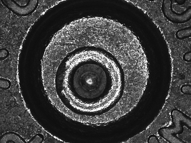
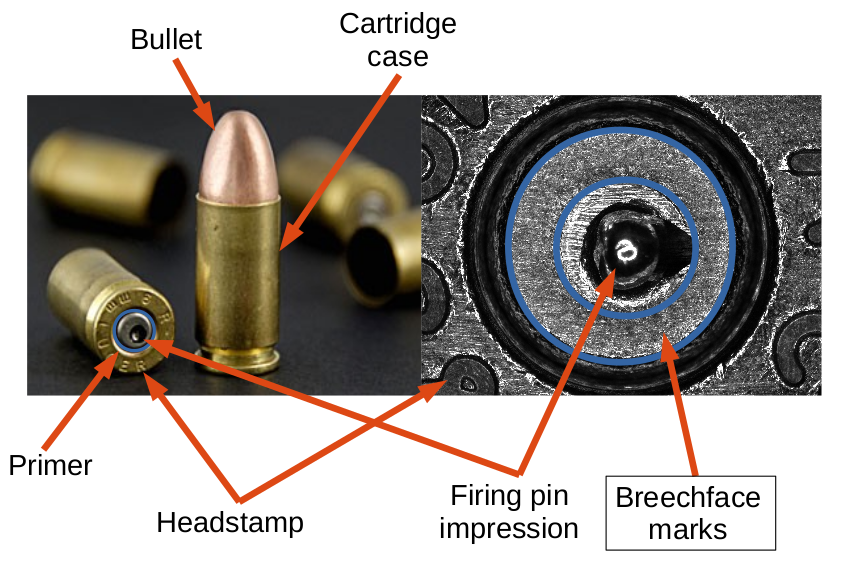
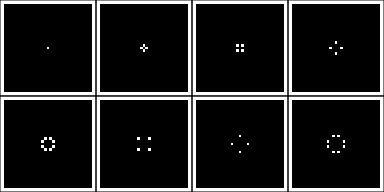
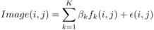
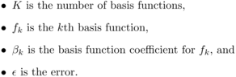
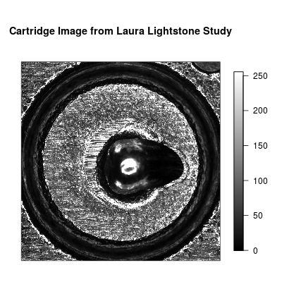
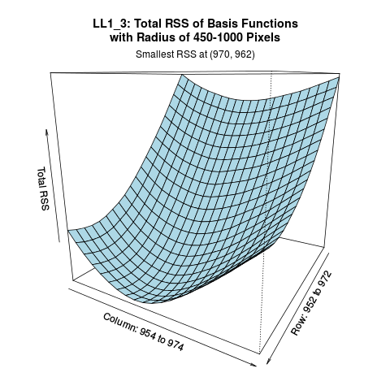
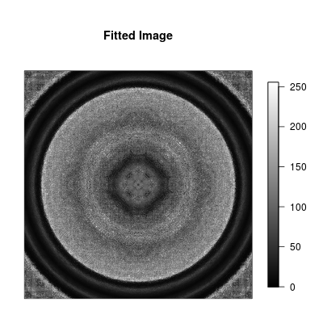
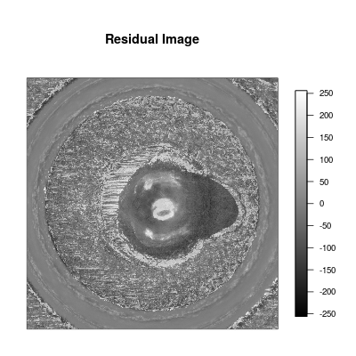

<!-- README.md is generated from README.Rmd. Please edit that file -->
cartridges
==========

This package contains utilities to read and plot cartridge case images. It pre-processes these images and implements an algorithm to compare the images. It produces a similarity score for each pairwise comparison and computes the probability of obtaining a higher score by chance. This is work in progress.

Images must be in the standard format as released by the National Institute of Standards and Technology (NIST). Such data are available from the [NIST Ballistics Toolmark Research Database](https://tsapps.nist.gov/NRBTD), and in particular we are developing methods for images of breech face impressions using 2D ring light. This methodology has been tested on images from the NBIDE study in the database. An example image from the database is below.



Background
----------

When a gun is fired, it leaves marks on the bottom surface of the cartridge, and these marks are thought to be unique to the gun, in other words each gun is thought to produce unique marks. Here the marks that we are interested in are the breechface marks, which are marked out in the image below. These marks are caused by the bottom surface of the cartridge pressing against the breech block of the gun during the firing process.



Since the marks are thought to be unique, when cartridge cases are collected from crime scenes, they can be compared to cartridge cases that have been collected previously, to see if they come from the same gun as something that has been seen before. Because of the large number of cartridge cases being collected, rather than comparing these physical cartridge cases, we are interested in using automated algorithms to compare these images of the bottom surface of the cartridge cases.

Given a new image and a database of images, this package implements tools to assess how similar the new image is to the images in the database, producing a similarity metric. To quantify the uncertainty in this comparison procedure, and also attach more meaning to the similarity scores, we also propose a method of computing the probability of obtaining a larger score by chance.

Description of method
---------------------

These are the steps for one pairwise comparison. There are 4 pre-processing steps before we compute the two measures that we are interested in.

1.  Automatically select breechface marks
2.  Level image
3.  Remove circular symmetry
4.  Outlier removal and filtering
5.  Maximize correlation by translations and rotations
6.  Compute probability of obtaining a higher score by chance

-------------------------------------- the rest of this document needs updating

To construct such a signature, we make use of the circular symmetry of the image. We assume that pixels located the same distance from the center of the image take the same value. We can then decompose each image into a linear combination of circularly symmetric basis. The first few matrices in the basis are given in the figure below, where each figure in the panel represents one matrix. Each matrix takes the value 1 for pixels that are the same distance from the center, and zero otherwise. Basis are enumerated from center outwards.



We represent these matrices as circularly symmetric basis functions, which take an ij coordinate as an input and return the value 0 or 1. An image can then be decomposed as follows:





The coefficient of each basis function is the mean of pixel values of pixels in that basis function, and these (or some function of these - further work is still being done) will form the image signature. The number of basis functions required depend on the size of the image. Standard images in the NIST database are 2592 x 1944 pixels, and after cropping to square we have images that are 1919 x 1919 pixels. A total of 276,569 basis functions are required for such images.

Installation
------------

If you do not have R installed, visit <https://www.r-project.org/>. You will also need to install the `devtools` package from CRAN using `install.packages("devtools")`.

To install this package:

``` r
library(devtools)
devtools::install_github("xhtai/cartridges")
```

After installing the `cartridges` package, load it using

``` r
library(cartridges)
```

For the function `readCropTIFF()` (see below) to work, you will also need to install either the `rgdal` package (recommended), or the `tiff` package. You can do so using `install.packages("rgdal")` or `install.packages("tiff")`.

#### Difficulties using devtools

If you are using a Linux machine, you might have some difficulties as `devtools` has a number of dependencies (e.g. `libssl-dev`, `libcurl4-gnutls-dev`). If you are unable to install these, you can download the [tarball](https://github.com/xhtai/cartridges/tarball/master) directly and install using `install.packages(file.choose(), repos=NULL)` or `R CMD INSTALL`. Before doing this, you will also need to install the following two R packages manually: `raster` and `fields`. You can do this using `install.packages()`.

``` r
install.packages(c("raster", "fields"))
install.packages(file.choose(), repos = NULL)
```

A window will pop-up and all you have to do is select the location of the .tar.gz file.

If you are using a Windows machine, you can do the same using a [.zip file](https://github.com/xhtai/cartridges/zipball/master).

#### Difficulties with rgdal or tiff

For `rgdal`, Linux users need to have the GDAL library installed. If you do not have it, use `sudo apt-get install libgdal-dev`. For `tiff`, you will need `libtiff4-dev`. If neither of these are available on your system and installing them is not an option, you might be out of luck. You may want to explore other tools for reading in TIFF files. A sample data set is pre-loaded and you can access it by simply referring to `LL1_3`. All other functions will still be available.

Functions available
-------------------

-   `readCropTIFF()`: to read in a raw image and obtain a matrix of pixel values
-   `plotImage()`: produces a plot from the matrix of pixel values
-   `shiftedImage()`: to shift the image to a specified center
-   `getBasisFunctions()`: to produce ij coordinates of the location of 1's for each basis function
-   `subsetBasis()`: returns basis functions with specified conditions, e.g. those with a certain number of pixels or those that are of a certain distance from the center
-   `statisticsByBasisFunction()`: calculates statistics for each basis function, e.g. mean of pixel values
-   `fitBasis()`: to fit basis functions and obtain coefficients for the image signature
-   `getFittedImage()`: produces a matrix of pixel values from the basis function coefficients

These are for centering the image, and the methodology is described further in the section below.

-   `roughCenter()`: computes a rough center location, to be used as a starting location for a grid search
-   `gridSearch()`: searches a grid of possible locations for the center of the image
-   `surfacePlot()`: produces a surface plot for determining the best location of the center

Help files with examples for each of these functions can be accessed using `help(functionName)` or `?functionName`, e.g. `help(plotImage)`.

### Methods for centering images

Before the basis functions are fitted, the image has to be properly centered. To determine an appropriate center, we first notice that images have a dark, symmetric outer ring. We fit the basis functions corresponding approximately to the radius of this ring, and if the image is properly centered, the fit obtained should be good.

We use basis functions with radius 450-1000 pixels, and compute the residual sum of squares of the fit. A better fit would produce a smaller residual sum of squares. We search over a grid of possible values, and the location resulting in the smallest residual sum of squares is the best center location. This is visualized using `surfacePlot()`.

As the grid search is a slow process, we can choose to use `roughCenter()` to first determine an appropriate starting location. This function is designed for speed and the center produced should not be used without first running `gridSearch()`. Briefly, the steps are as follows:

-   convert the images from 256-grayscale to binary values, with values from 0 to 127 taking the value 0 and those from 128 to 255 taking the value 1
-   along an input row, consider 201 possible center locations from columns 860 to 1060
-   at each possible center, sum the binary pixel values for each basis function. Find the longest continuous string of basis functions where the calculated sum is zero, and obtain the number of basis functions in that string.
-   the best column is the one with the longest continuous string of zeros
-   along the best column, consider 201 possible rows (100 above and 100 below the input row)
-   choose the center resulting in the longest string of continuous zeros.

We recommend repeating this for rows 940 and 980. To speed up the process further, we can choose to use only basis functions with 8 pixels, as these are the most common.

Example
-------

The following steps produce a signature for the example image above. This image is from the [Laura Lightstone study](http://www.nist.gov/forensics/ballisticsdb/lightstone-study.cfm) in the NIST database.

First read in the data:

``` r
LL1_3 <- readCropTIFF(system.file("extdata", "LL1_3.tif", package = "cartridges"))
```

We can plot this image:

``` r
plotImage(LL1_3, "original", grayscale = TRUE, main = "Cartridge Image from Laura Lightstone Study")
```



Next we obtain the basis functions for an image of size 1919 x 1919 pixels. (Note that this might take up to half an hour, depending on your system. If you do not want to wait, the data produced is pre-loaded with this package and you can access it by just referring to `basis1919`, e.g. `length(basis1919)`.)

``` r
basis1919 <- getBasisFunctions(1919)
```

We take subsets of the basis functions by specifying the radius from the center of the outer ring (450-1000 pixels), and the number of pixels in each basis function.

``` r
basis1919_rad450_1000 <- subsetBasis(basis1919, c(450, 1000))
basis1919_8pixels_rad450_1000 <- subsetBasis(basis1919, c(450, 1000), 8)
```

Now we determine a rough center by searching along row 980. Again, note that this is a long computation and may take up to half an hour. If you do not want to wait, the coordinates produced are (962, 964), and you can simply input this into `gridsearch()` using `gridsearch(LL1_3,basis1919_rad450_1000,962,964)`.

``` r
out <- roughCenter(LL1_3, basis1919_8pixels_rad450_1000, 980)
best <- out[which.max(out$maxRun), ]
```

We then do a grid search for the smallest residual sum of squares, producing a surface plot for visualization. This could take up to an hour or more, and should produce the coordinates (970, 962) as the best center.

``` r
RSSdtf <- gridSearch(LL1_3, basis1919_rad450_1000, best$i, best$j, plot = TRUE)
best <- RSSdtf[which.min(RSSdtf$totalRSS), ]
```



With the center (970, 962), we shift the image as follows.

``` r
shifted <- shiftedImage(LL1_3, best$centeri, best$centerj)
```

We can then fit the basis functions using `LL1_3_basis <- fitBasis(shifted, basis1919)`, but a better alternative would be to first crop the image. This is because with the shifting process, we introduced a black border by setting pixels that were not available to 0. Cropping the image would remove this border.

``` r
shifted <- shifted[76:1844, 76:1844]
LL1_3_basis <- fitBasis(shifted, basis1769)
```

Now with the fitted coefficients, we can obtain and plot the fitted 1769 x 1769 image.

``` r
fittedImage <- getFittedImage(LL1_3_basis, basis1769, 1769)
plotImage(fittedImage, "original", grayscale = TRUE, main = "Fitted Image")
```



We can also obtain and plot the residuals.

``` r
residualImage <- shifted - fittedImage
plotImage(residualImage, "residuals", grayscale = TRUE, main = "Residual Image")
```



Further work
------------

This is work in progress and there are many possible improvements to both the methodology and the code. Some of these are:

-   Develop additional methods to model the residuals and capture the asymmetries
-   Reduce the dimension further by fitting a local smoother
-   Improve centering procedure
-   Many code speed-ups are possible
-   Error-checking for functions.

Credits
-------

This is work with William F. Eddy. The NIST database is maintained by Xiaoyu Alan Zheng.

License
-------

The `cartridges` package is licensed under GPLv3 (<http://www.gnu.org/licenses/gpl.html>).
